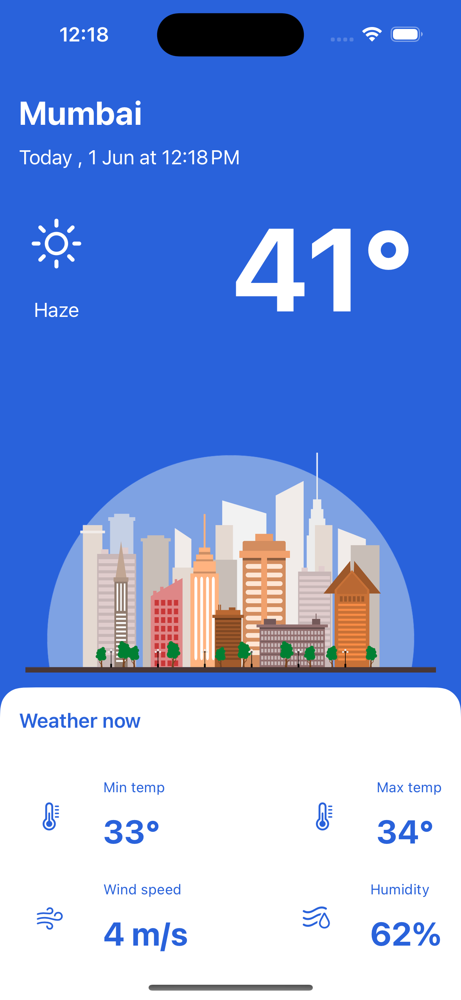

# WeatherApp

## 📜 Overview

WeatherApp is an iOS application built with SwiftUI that provides users with current weather information for their chosen locations. The app fetches weather data from the [OpenWeatherMap API](https://api.openweathermap.org) and displays it in a user-friendly interface. This project showcases my ability to integrate third-party APIs, manage data in Swift, and build clean, responsive UI components using SwiftUI.

## Key Features

- **Current Weather Information:** Displays the current weather, including temperature, humidity, and weather conditions.
- **Location Search:** Allows users to search for and select different locations to view weather information.
- **Dynamic UI:** Uses SwiftUI to create a dynamic and responsive user interface that updates in real-time based on API data.

## ⚓ Key Learning Points

### 1. SwiftUI Development
- Developed a user-friendly interface using SwiftUI, leveraging its powerful and flexible UI components.

### 2. API Integration
- Gained experience in integrating the OpenWeatherMap API to fetch and display weather data.
- Learned how to handle JSON parsing and manage asynchronous network requests in Swift.

### 4. Error Handling
- Implemented error handling to manage API errors and provide feedback to the user.

## 🌐 Why Showcase This Project?

As a beginner in iOS development, showcasing the WeatherApp demonstrates my ability to build a functional and visually appealing application. This project highlights my skills in API integration, data handling, and creating dynamic user interfaces with SwiftUI. By sharing this project, I aim to demonstrate my dedication to learning and improving my technical abilities in iOS development.

## 📱 Screenshots

## Usage

To use this project:

1. Clone or download the repository.
2. Open the project in Xcode.
3. Run the app on a simulator or physical device.
4. Search for a location to view its current weather information.

## Future Improvements

- Add a feature to display a weekly weather forecast.
- Implement user authentication to save favorite locations.
- Enhance UI with animations and additional weather icons.

##  ☎ Contact

For any inquiries or further discussion about this project or my skills as an iOS developer, please feel free to contact me:

[📧 Mail](mailto:ashrafhatia@gmail.com ) : ashrafhatia@gmail.com 

## 🎥 App Recording
